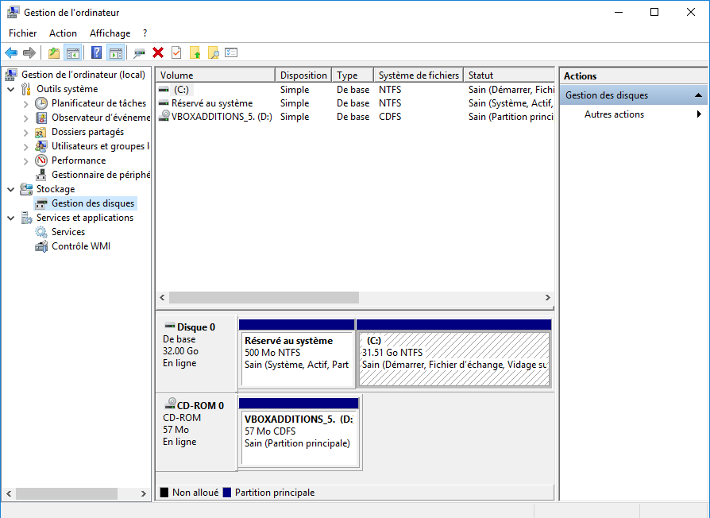

<!-- header: "Module 187 - Surveillance et outils" -->
# 11 - Surveillance et outils

ID du module 187 : OO9

Ce chapitre traite des outils disponibles pour surveiller le système et aider à solutionner des problèmes.

---

## Outils Windows

**ATTENTION** : Ces outils demandent généralement les droits administrateur. Il faut rester prudent lors de leur utilisation !

---

## CRT+ALT+DEL

Permet de verrouiller/déconnecter la session, changer d'utilisateur, modifier le mot de passe, accéder au gestionnaire de tâches, arrêter l'ordinateur.

---

## Gestionnaire de tâches

Accès : CRT+ALT+DEL ou Ctrl+Shift+Esc

Onglets :
- Processus
- Performance
- Historique des applications
- Démarrage
- Utilisateurs
- Détails
- Services
---

---

## Configuration système (MSConfig)

Accès : recherche "MSConfig" ou "configuration système"

Onglets :
- Général
- Démarrer
- Services
- Démarrage
- Outils

---

---

## Mode sans échec

Options dans l'onglet Démarrer :
- Minimal : désactive tout ce qui n'est pas nécessaire
- Réseau : active la connexion réseau

---

---

---

## Menu clic droit Windows

Beaucoup d'outils accessibles via clic droit sur le logo Windows.

---

## Outils d'administration

Outils d'administration disponibles dans Windows.

---

## Gestion des disques

Modification, ajout, suppression de partitions.

---

## Gestionnaire de périphériques

Voir le matériel installé et les erreurs éventuelles.

---

## Connexions réseau

Voir l'état des connexions réseau.

---

## Observateur d'événements

Journaux : Application, Sécurité, Système

---

## Options d'alimentation

Déjà vu dans le chapitre Ergonomie et durabilité.

---

## Applications et fonctionnalités

Voir, modifier, supprimer les applications installées.

---

## Gestion de l'ordinateur

Outils :
- Planificateur de tâches
- Observateur d'événements
- Dossiers partagés
- Utilisateurs et groupes locaux
- Performance
- Gestionnaire de périphériques
- Gestion des disques
- Services et applications

---

---

## Registry

Accès par la commande regedit (Éditeur de registres). Demande les droits d'administrateur.

---

## Système

Informations sur le nom de l'ordinateur, workgroup/domaine, processeur, RAM, version OS.

---

## Informations système

Exporter un fichier texte avec toutes les infos système.

---

## Panneau de configuration et paramètres

Le panneau de configuration regroupe plusieurs fonctionnalités essentielles.

---

---

## Options d'ergonomie

Ajustements pour personnes en situation de handicap dans le panneau de configuration.

---

## Environnement de récupération Windows (WinRE)

Accès : Maj + redémarrage
- Boot sur W10
- Dépannage
- Éteindre

---

## Dépannage et options avancées

Choix de réinitialiser le PC, conserver ou non les fichiers personnels.

---

---

Options avancées : redémarrage, restauration, vérification.

---

## Propriétés du disque

Onglet Outils : vérifier et optimiser le lecteur.

