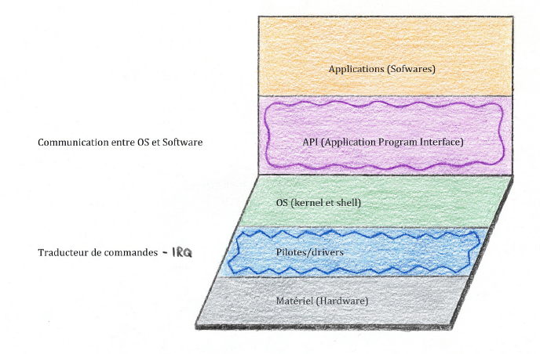
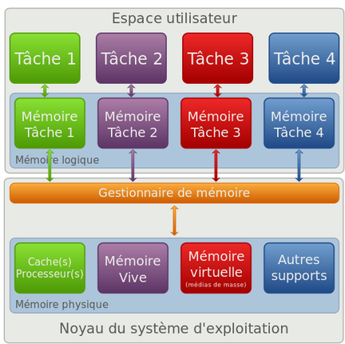
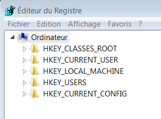
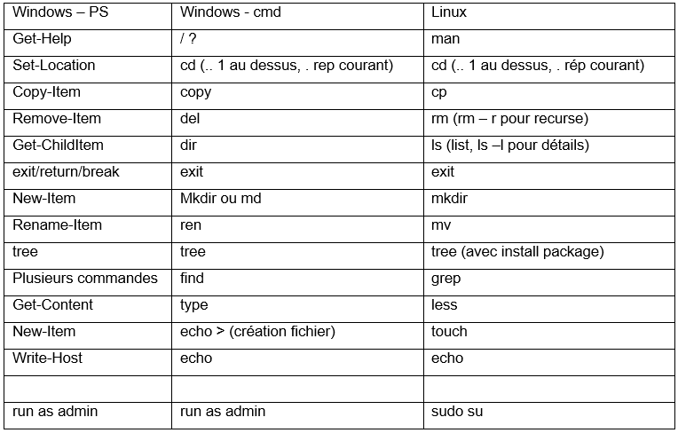
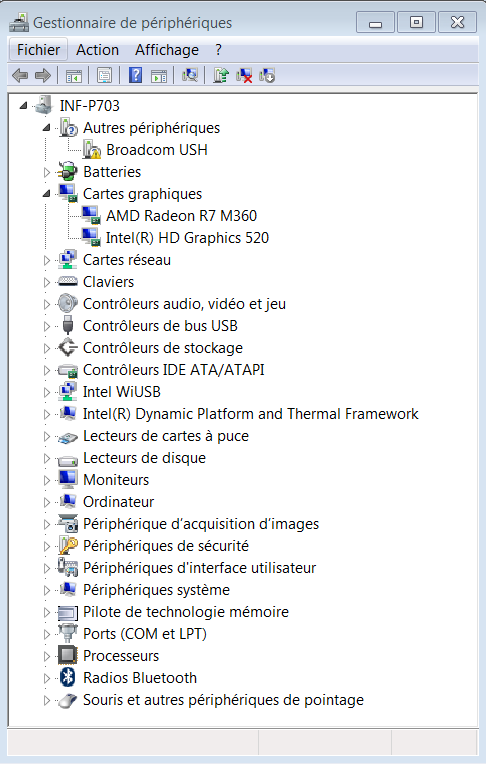
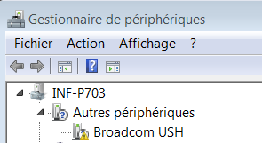
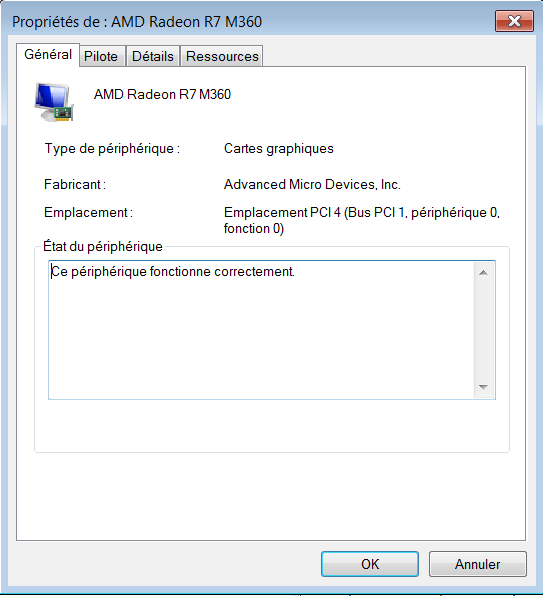
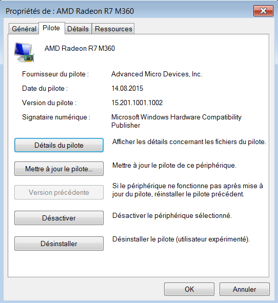
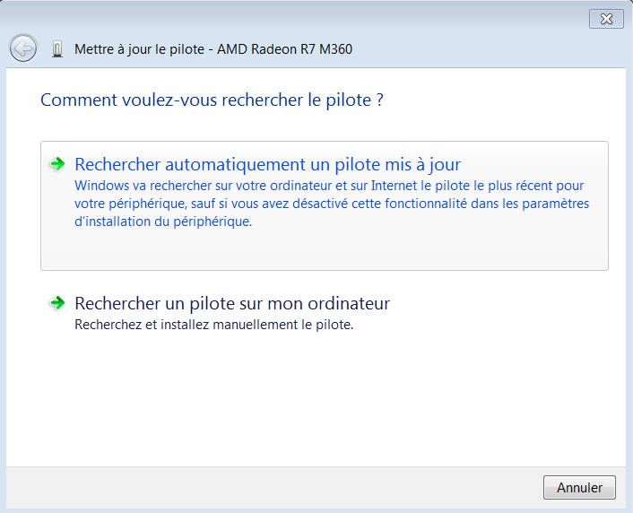

<!-- header: "Module 187 - Système d'exploitation" -->
# 3 - Système d'exploitation

ID du module 187 : OO6

Ce chapitre traite la notion de système d'exploitation ainsi que celles du kernel ou des drivers.

---

## Qu'est-ce qu'un OS ?

**OS** signifie **Operating System** (Système d'exploitation).

Un système d'exploitation est un ensemble de programmes qui fait le lien entre le matériel et les applications de l'utilisateur.
Son rôle :
- Gérer les ressources (RAM, processeur, disques, périphériques)
- Partager les ressources entre programmes et utilisateurs
- Traiter les problèmes

---

## Les couches d'interaction

On peut représenter des couches pour l'interaction :

---

## Drivers, IRQ et API

- **Drivers (pilotes)** utilisent les **IRQ** (Interrupt ReQuest) pour interagir avec le système
- **API** : bibliothèques propres à chaque application
- Les API peuvent être téléchargées avec leur documentation

---

## Kernel et Shell

- **Kernel (noyau)** : gère les ressources
- **Shell (coquille)** : interface entre l'OS et l'utilisateur
  - Windows : PowerShell
  - Mac/Linux : bash

---

## Fonctions du kernel

- Gestion du processeur
- Gestion de la mémoire
- Gestion des entrées/sorties
- Gestion des applications
- Gestion des droits
- Gestion des fichiers
- Informations sur la machine

L'OS est le chef d'orchestre qui dirige les demandes de mémoire, réseau, stockage, périphériques.

---

## Multi-utilisateurs et multi-tâches

- **Multi-utilisateurs** : plusieurs utilisateurs, authentification, espace de travail dédié
- **Multi-tâches** : gestion des conflits, optimisation des ressources

Toutes les instructions pour le matériel passent par le noyau, seul à avoir les droits.

---

## Appels système et espaces mémoire

- **Appel système** (System Call = syscall) : demande d'une tâche au système d'exploitation par une application, passe toujours par le noyau
- Exemples : `open` (ouvrir un fichier), `kill` (terminer un processus)

On parle d'**espace noyau** et d'**espace utilisateur** :
- **Espace noyau (OSK)** : mode superviseur, accès total à la mémoire
- **Espace utilisateur (OSU)** : chaque application a sa zone protégée

---

---

## Plug and Play

Dans le noyau se trouvent aussi les pilotes pour les périphériques, ce qui permet d'ajouter facilement du matériel (**plug and play**).

---

## Registry (Registre Windows)

Depuis Windows NT, toutes les infos sur l'OS, le matériel, les applications et les utilisateurs sont stockées dans une base de données hiérarchique appelée **Registry**.

On y accède avec **regedit**. Organisé comme un arbre avec 5 clés principales (hives), des sous-clés et des valeurs.

À manier avec précaution, pas de sécurité si on modifie ou supprime une clé ou valeur.

[Windows Registry keys](https://www.enigmasoftware.com/what-are-registry-subkeys-how-they-work/)

---

## Shell et commandes

Deux types d'interfaces :
- **GUI** (Graphic User Interface) : Explorer (Windows), Gnome/KDE (Linux)
- **CLI** (Command Line Interface) : cmd.exe, powershell (Windows), csh, ksh, bash (Linux/Mac)

Un script regroupe des commandes du shell dans un fichier.

---

---

## Commandes utiles

- [Linux-commandes de base-ubuntu](https://doc.ubuntu-fr.org/tutoriel/console_commandes_de_base)
- [Linux-commandes de base-buzut](https://buzut.net/101-commandes-indispensables-sous-linux/)
- [Windows-commandes de base-zebulon](https://www.zebulon.fr/dossiers/windows/63-invite-de-commandes-cmd.html)
- [Windows-commandes de base-PS](http://www.infonovice.fr/decouvrir-les-commandes-de-base-sous-powershell/)
- [Windows-commandes de base-developpez](https://windows.developpez.com/cours/ligne-commande/?page=page_4)

---

## Dossiers, fichiers et chemins

- Dossier (folder) ou répertoire (directory)
- Fichier (file)
- Sous-répertoires (subfolders)
- Chemin relatif ou absolu
- "." = répertoire courant, ".." = répertoire parent
- Linux est sensible à la casse

---

## Pilotes et gestionnaire de périphériques

Un **pilote** (driver) est un logiciel qui fait le lien entre l'OS et le matériel.

Exemples de pilotes : carte graphique, réseau, son, imprimante, disque, scanner...

Vérifier la compatibilité avec l'OS, la version et la source du téléchargement.

En l'absence du bon pilote, un pilote générique est utilisé (résolution moindre, fonctionnalités limitées).

Dans les systèmes actuels, les pilotes sont détectés et installés automatiquement (**Plug and Play**), sinon installation manuelle.

Dans le **gestionnaire de périphériques** se trouve tout le matériel du système.

---

---

## Gestionnaire de périphériques : erreurs

Première ligne : périphérique ne fonctionnant pas correctement.

---

## Pilote de carte graphique

Onglet général : état du pilote

---
## Pilote de carte graphique

Onglet pilote : version, mise à jour, suppression, désactivation

---
## Pilote de carte graphique

Mise à jour : bouton "Mettre à jour le pilote"

---

## Systèmes d'exploitation les plus répandus (2024)

- Windows (73,41%)
- Mac (15,49%)
- Linux (4,31%)
- ChromeOS (2,12%)

[Stat leptidigital](https://mondetech.fr/parts-de-marche-des-systemes-dexploitation-en-2024/)
