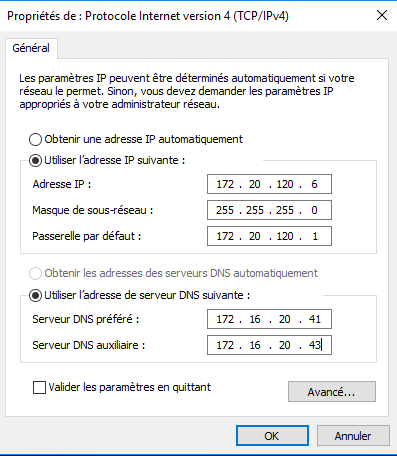
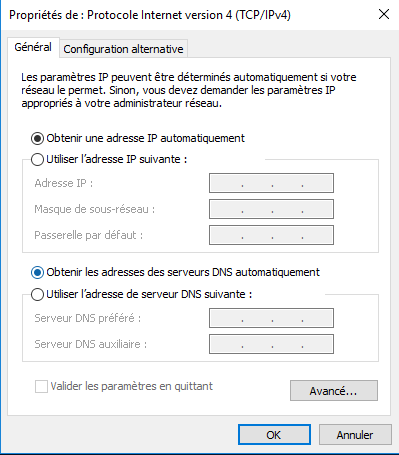
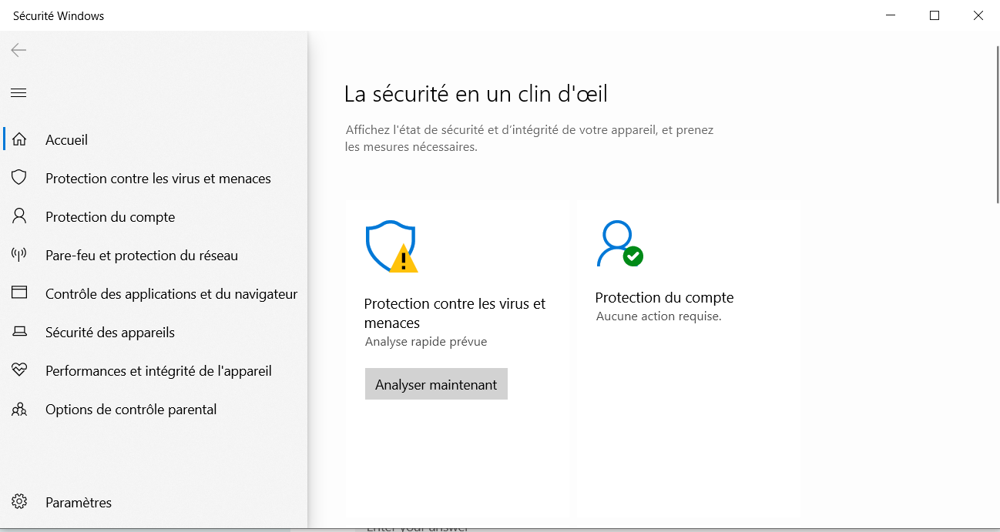

<!-- header: "Module 187 - Configuration réseau" -->
# 6 - Configuration réseau

ID du module 187 : OO3 et OO4

Ce chapitre traite de la configuration du réseau ainsi que des notions pour solutionner les problèmes.

---

## Adresse IP et TCP/IP

Tout le monde est connecté à Internet et utilise une adresse IP.

Chaque appareil (téléphone, ordinateur, ...) a une adresse IP pour accéder à Internet.

**TCP/IP** (Transmission Control Protocol/Internet Protocol) : suite de protocoles pour l'utilisation d'Internet.

---

## IP fixe ou automatique (DHCP)

Deux possibilités pour obtenir une adresse IP :
- Fixe
- Automatique (DHCP)

Configuration dans les paramètres de la carte réseau :
- Centre de réseau et partage
- Modifier les paramètres de la carte
- Propriétés de la carte
- Propriété IPv4

---

## IP fixe

Pour une IP fixe, on saisit l'adresse IP, le masque, la passerelle et le DNS dans les paramètres de la carte réseau du PC.

---

## IP automatique (DHCP)

Pour DHCP, on définit dans les paramètres réseau l'utilisation du DHCP.
**DHCP** (Dynamic Host Configuration Protocol) : serveur qui distribue des adresses IP.

---

## Outils de diagnostic

- **ping** : tester la réponse d'un objet de destination (niveau IP)
- **ipconfig/all** : voir les détails de configuration

---

## Sécurité : pare-feu

Le **pare-feu (firewall)** est un élément de sécurité qui contrôle les entrées-sorties du flux de données, protégeant l'intérieur du réseau du monde extérieur.

[Wikipedia parefeu](https://fr.wikipedia.org/wiki/Pare-feu_(informatique))

---

## Sécurité : antivirus

Un autre élément de sécurité est l'antivirus. Sous Windows 10-11, c'est Windows Defender. Il existe d'autres antivirus gratuits ou payants.

[Comparaison antivirus le blog du hacker](https://www.leblogduhacker.fr/quel-est-vraiment-le-meilleur-antivirus/)

[Comparaison antivirus clubic](https://www.clubic.com/article-77079-1-guide-comparatif-meilleur-antivirus.html)

La meilleure protection reste la vigilance et la prudence !

---

---

## Mises à jour des OS

Pour faciliter la mise à jour des OS, Microsoft utilise les mises à jour automatiques via Internet pour les particuliers.

En entreprise, les mises à jour sont distribuées par un serveur.

Les fichiers de mise à jour sont stockés sur le disque système dans un répertoire temporaire, qui n'est pas vidé à la fin. Cela peut poser problème si le disque n'a pas assez de capacité.
