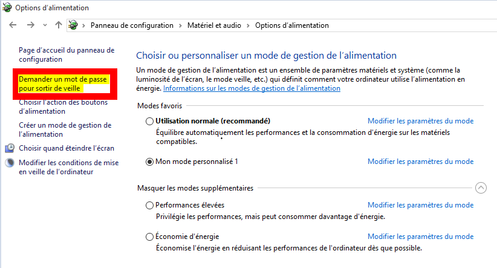

<!-- header: "Module 187 - Ergonomie et durabilité" -->
# 8 - Ergonomie et durabilité

ID du module 187 : OO5

Ce chapitre traite de l'ergonomie, de l'optimisation d'énergie et de la durabilité.

---

## Ergonomie

Définition selon Larousse :
- Étude quantitative et qualitative du travail dans l'entreprise, visant à améliorer les conditions de travail et à accroître la productivité.

Dans notre cas, l'ergonomie est la façon d'organiser correctement et confortablement son matériel sur le bureau et de faire les réglages adéquats.

---

## Documents pour le bien-être au travail

Les documents ci-dessous donnent toutes les informations importantes pour le bien-être concernant le travail sur écran et l'ergonomie de la place de travail :

- [Place de travail (PDF)](SUVA-place-de-travail.pdf)
- [Travail sur écran (PDF)](SUVA-travail-sur-ecran.pdf)
- [Site de la SUVA](https://www.suva.ch/)

---

## Énergie : PC fixe ou portable

- PC portable : batterie, autonomie électrique
- PC fixe : branché à une prise de courant

Dans Windows 10-11, pour accéder aux choix :
- Panneau de configuration > Options d'alimentation
- Ou clic droit sur le logo Windows > Options d'alimentation

---

## Modes d'alimentation

Trois modes principaux :
- Utilisation normale
- Économie d'énergie
- Performances élevées (caché dans modes supplémentaires)

Il existe des différences selon les machines. On peut aussi définir des mots de passe et choisir plusieurs options.

---

---

---

## Mode personnalisé

On peut également créer son mode personnalisé.

Pour un PC portable, les choix sont identiques avec en plus, les options pour la batterie.

---

## Durabilité

L'écologie et le développement durable sont des sujets d'actualité. À l'école, un groupe nommé GIDDE (Groupe d'Intérêt pour le Développement Durable à l'ETML) a été créé pour ces questions.

Il a regroupé dans deux documents des recommandations pour sensibiliser à la durabilité concernant les ordinateurs :

- [Recommandation pour l'achat du matériel informatique (PDF)](RecommandationAchatMaterielInformatique.pdf)
- [Recommandation pour l'utilisation du matériel informatique (PDF)](RecommandationUtilisationMaterielleInformatique.pdf)

---

## Plus : recommandations Android et iOS

Le GIDDE a également produit des documents pour Android et iOS :

- [Recommandation Consommation Energie Android (PDF)](RecommandationConsommationEnergieAndroid.pdf)
- [Recommandation Consommation Energie IOS (PDF)](RecommandationConsommationEnergieIOS.pdf)
