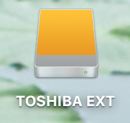

<!-- header: "Module 187 - Organisation des dossiers" -->
# 9 - Organisation des dossiers

ID du module 187 : OO8

Ce chapitre traite de l'organisation des fichiers dans l'arborescence de Windows ainsi que les points de montage.

---

## Arborescence Windows

L'OS est toujours installé sur le disque **C:**. L'arborescence contient les dossiers Utilisateurs, Programmes, Programmes(x86) et Windows.

La taille minimale de la partition C: doit être de 64GB selon Microsoft.

---

## Dossiers principaux

- Utilisateurs : dossiers des utilisateurs locaux
- Programmes : programmes 64 bits
- Programmes (x86) : programmes 32 bits
- Windows : fichiers système

---

## Formatage

- Formatage rapide : efface l'index de la partition, le contenu reste récupérable
- Formatage standard : supprime l'index et le contenu physique du disque

---

## Points de montage (Windows)

Un **point de montage** définit le point d'accès pour le contenu d'une partition (Windows, Linux, Mac).

Dans Windows, les points de montage sont définis par des lettres visibles dans l'Explorateur de fichiers. On utilise le gestionnaire de disques pour les modifier.

---

## Points de montage avancés

- Dès qu'une partition a une lettre, elle est montée
- Possible de monter une partition dans un dossier (icône modifiée)
- Pour voir tous les points de montage : Powershell `Get-SmbShare`

---

## Linux : racine et dossiers

Dans Linux, la racine est définie par `/`. Si le point de montage de la racine est supprimé, le système ne fonctionne plus.

---

## Dossiers Linux

- dev : périphériques (disques)
- etc : fichiers éditables (utilisateurs, groupes)
- home : dossiers personnels
- mnt : points de montage

Plus d'infos : [Ubuntu arborescence](https://doc.ubuntu-fr.org/arborescence)

---

## Linux : vue graphique

Dans le mode graphique de Linux, des icônes définissent la racine et le home directory de la session en cours.

- Système de fichiers = `/`
- Répertoire personnel = `/home`

---

## Mac : vue graphique

- Disque dur

---

- Disque externe

---

## Gestionnaire de disques : Windows vs GParted

---

---

## Parallèle Windows/Linux

- disque 0 = `/dev/sda`
- `/dev/sda1` : partition réservée au système
- `/dev/sda2` : système Windows
- `/dev/sda3` : racine Xubuntu
- `/dev/sda4` : `/home` Xubuntu

Linux nomme les partitions :
- `/dev/sd*` : disques SATA
- `/dev/hd*` : disques IDE
- `/dev/sr*` : CD
- `/dev/fd*` : floppy

---
## Nommage des partitions

Exemple :
- Disque SATA : `/dev/sda1`, `/dev/sda2`, `/dev/sda3`
- Disque IDE : `/dev/hda1`, `/dev/hda2`, `/dev/hda3`

[Linux naming convention - TLDP](https://www.tldp.org/HOWTO/Partition-Mass-Storage-Definitions-Naming-HOWTO/x99.html)

[Dell Linux naming convention](https://www.dell.com/support/article/ch/de/chbsdt1/sln151767/termes-linux-ubuntu-relatifs-au-disque-dur-et-aux-p%C3%A9riph%C3%A9riques-en-anglais?lang=fr)

---
## Nommage des disques sous Linux

Sous linux les disques sont nommés par des lettres (sda, sdb, sdc...) et les partitions par des chiffres (sda1, sda2, sdb1...).

Par exemple si j'ajoute un disque dur SATA, il sera nommé `/dev/sda` et la première partition sera `/dev/sda1` et si j'ajoute un second disque dur SATA, il sera nommé `/dev/sdb` et la première partition sera `/dev/sdb1`.

---

## fstab et mtab

Dans Linux, les partitions sont montées sur des répertoires. Contrôler dans `/etc/mtab` les partitions montées pour la session en cours.

- En ligne de commande : `mount` affiche le contenu de mtab
- `/etc/fstab` : partitions montées automatiquement au démarrage

[Wiki Ubuntu fstab](https://doc.ubuntu-fr.org/mount_fstab)
