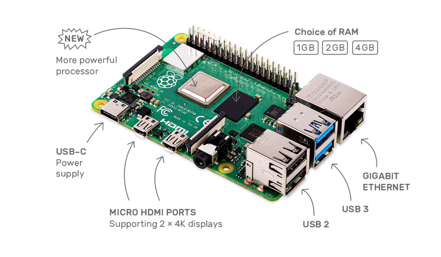
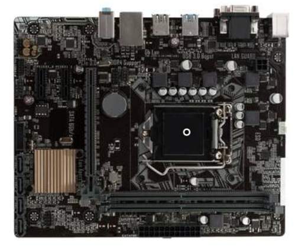
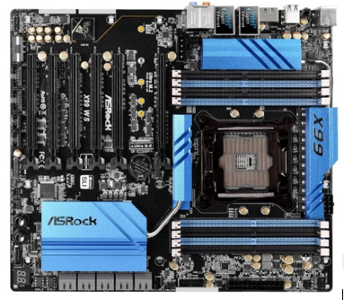
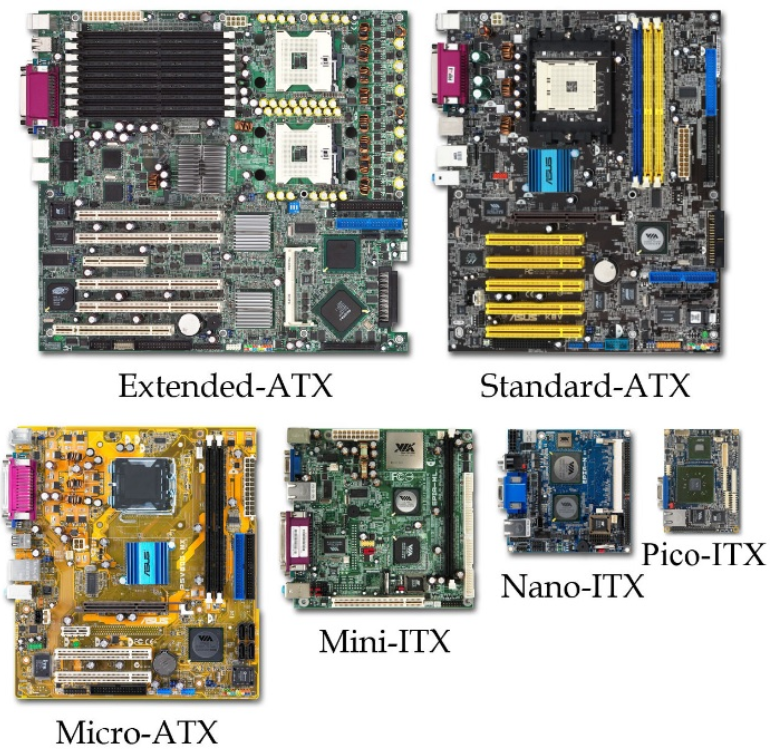
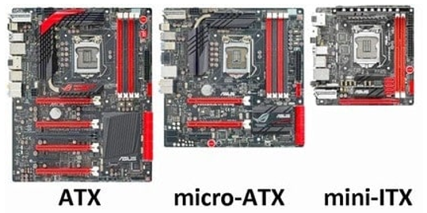

<!-- header: "Module 187 - Partie matériel" -->
# 1 - Partie matériel

ID du module 187 : OO1

Ce chapitre traite de la partie matérielle des PCs comme les cartes mère, les processeurs ou les connecteurs ainsi que des périphériques comme les claviers ou les écrans.

---

## Qu'est-ce qu'un PC ?

Un **PC** (**Personal Computer**) est un ordinateur à usage individuel et de taille réduite. 
Dans les années 80, IBM a normalisé et standardisé les composants des ordinateurs, ce qui a favorisé son développement planétaire.

Il y a 2 aspects dans un ordinateur : le **Hardware** et le **Software**.
- **Hardware** : pièces physiques d'un ordinateur (matériel)
- **Software** : logiciels (programmes)

Dans ce chapitre, nous traiterons de la partie **Hardware**.

---

## Les éléments principaux d'un ordinateur

Un ordinateur est composé de divers éléments :
- boîtier
- alimentation électrique
- carte mère
- stockage
- RAM
- connecteurs
- carte réseau

---

Une version très basique d'un ordinateur est le Raspberry Pi4, sans boîtier et qui coûte moins de 100CHF.



---

## Conseils de sécurité

Quelques informations et astuces utiles lors du montage ou démontage d'un PC :
- Toujours utiliser un **tapis anti-statique** branché à la terre
- Travailler dans un espace propre et organisé
- Le PC doit toujours être **éteint**

---

## Alimentation (PSU)

**PSU** (**Power Supply Unit**) ou alimentation électrique, transforme le courant du secteur en courant continu TBT (5 ou 12V).

L’alimentation fournit du courant électrique à l’ensemble des composants de l’ordinateur. 
Le bloc d’alimentation doit posséder une puissance suffisante pour alimenter les différents périphériques.

Aux États-Unis et au Canada, la tension est de 120 V/60 Hz, alors qu’en Europe la norme est de 230 V/50 Hz. Un commutateur permet de choisir le type de tension.

---


---

Il est possible d'éteindre l'alimentation avec un bouton placé à côté de la prise.

La norme **80PLUS** assure un rendement d'au moins 80% pour une charge à 25 %, 50 % et 100 %. C'est un gage de qualité et d’économies.

[Wiki 80Plus](https://en.wikipedia.org/wiki/80_Plus)

---

## Boîtier (Châssis)

Il existe différentes tailles de boîtiers (châssis) et types :
- tour (tower)
- bureau (desktop)
- mini PC (barebone)

Le plus répandu est l'**ATX** qui offre le plus grand choix pour les cartes mères et les extensions pour grande ou moyenne tour.

Plus le boîtier est petit, plus la ventilation doit être efficace et moins il y a de place pour des ajouts. Exemple extrême : le laptop.

[TopAchat - Choix du boîtier](https://www.topachat.com/comprendre/choisir-boitier-pc.php)

---

## Carte mère

C'est l'élément central du PC. Elle doit être choisie selon les besoins de l'utilisateur. Elle contient généralement une carte graphique intégrée et une carte réseau.

On peut trouver les infos la concernant dans le **setup (BIOS)**, sur une étiquette dans le boîtier, ou dans **Informations système** sous Windows.

Avec le nom du constructeur et de la carte mère, il est possible de trouver les informations concernant le démarrage et les connexions du front panel. Des "bips" se feront entendre en cas de problème matériel.

---



---



---

## Processeur (CPU)

Le processeur est indispensable sur la carte mère. Il doit être choisi en fonction du socket.
- Détrompeur pour bonne insertion
- Ventirad fixé avec pâte thermique (couche fine et régulière)
- Utiliser un tapis anti-statique
- Ne pas toucher les parties métalliques
- Pâte diélectrique (non conductrice)

[Application de pâte thermique](https://www.youtube.com/watch?v=8mAM1LjMWEs)

---

## RAM

- Choisir le même type de barrettes
- Les mettre dans les slots de même couleur
- Détrompeur pour mise dans le bon sens
- Appuyer pour entendre les deux clics

---

## Disques de stockage

Il existe deux sortes de disques :
- **HDD** (Hard Disk Drive) : mécanique
- **SSD** (Solid State Drive) : électronique

Différences : prix, poids, bruit, résistance aux chocs

---

## Connecteurs

- Connecteurs internes : AGP, PCI-e, SATA
- Connecteurs externes : DP, DVI, HDMI, jack, RJ45, SATA, USB, USB-C, Thunderbolt

[Connecteurs Wikipedia](https://fr.wikipedia.org/wiki/Connectique)

---

## Carte mère : détails

Une **carte mère** est l'élément central d'un ordinateur (**motherboard** ou **MoBo**).

C'est un circuit imprimé avec :
- emplacements (slots) pour mémoire/cartes
- socket pour le processeur





---

## Carte mère : composants

- **Socket** : support pour le processeur et ventirad
- **Processeur (CPU)** : unité centrale de traitement
- **Slots RAM** : pour la mémoire vive
- **Connecteurs USB** : clavier, souris
- **Connecteurs SATA** : disques durs
- **Connecteurs électriques** : alimentation
- **Connecteur RJ45** : réseau
- **Chipset** : northbridge (rapide), southbridge (lente)

---


---

## BIOS/UEFI et pile

- **BIOS/UEFI** : composant pour le démarrage du PC (UEFI = évolution du BIOS)
- **Pile** : garde les infos dans le CMOS pour le démarrage

---

## Périphériques

Les périphériques regroupent tout ce qu'on peut connecter à un ordinateur :
- clavier (USB ou sans fil)
- souris (USB ou sans fil)
- écran (DP, HDMI, USB-C, DVI, VGA)
- imprimante (laser ou jet d'encre, réseau ou directe)

[Logitec Unifying](https://www.logitech.com/fr-fr/resource-center/what-is-unifying.html)

[Comment connecter un écran à un PC (Dell)](https://www.dell.com/support/kbdoc/fr-ch/000132424/how-to-connect-a-monitor-to-a-pc?lang=fr)

---

## Plus : Informations complémentaires sur le processeur

Le processeur est composé de :
- horloge
- coeurs physiques ou logiques
- mémoire cache niveau 1, 2 et 3
- ALU (Unité de calcul Arithmétique et Logique)
- processeur graphique intégré


---

## Bus et bande passante

Un **bus** est un ensemble de fils qui transmet de l'information (données, adresses, contrôle).
Le contrôleur de bus gère l'information qui transite sur le bus.

La **bande passante** est le débit maximal des données (taux de transfert).

**Formule :**

```
Bande passante (o/s) = Largeur du bus (o) x Fréquence (Hz)

  o/s : octets par seconde
  o : octets
  Hz : Hertz
```

Pour augmenter la bande passante, il faut augmenter la largeur de bus et/ou la fréquence.
