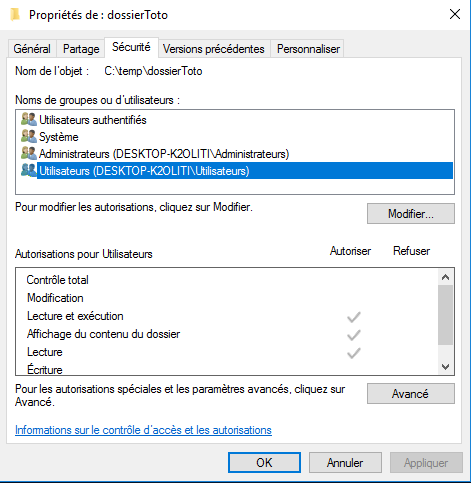
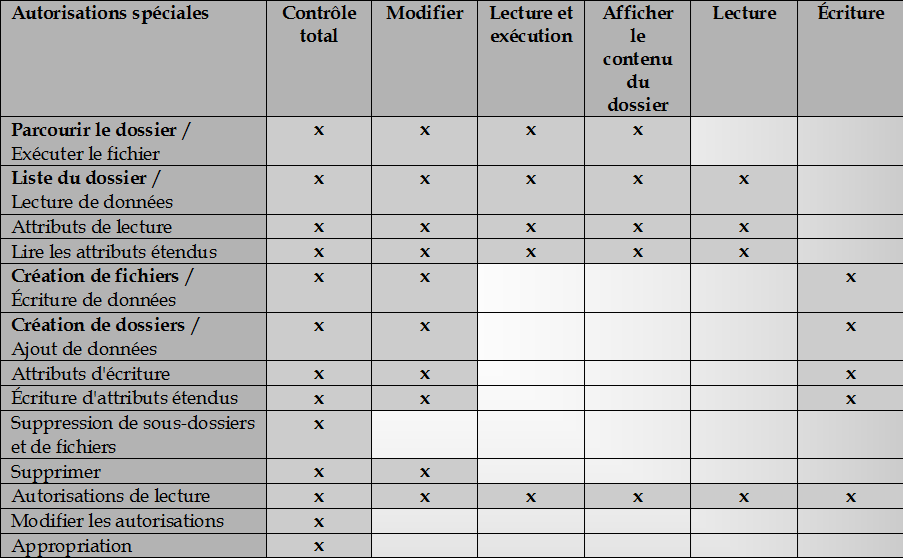
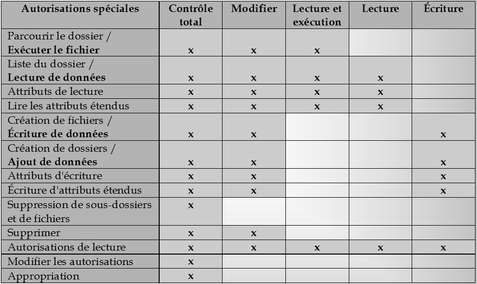
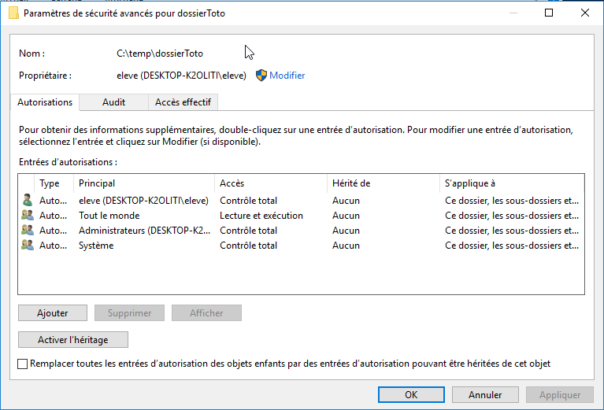
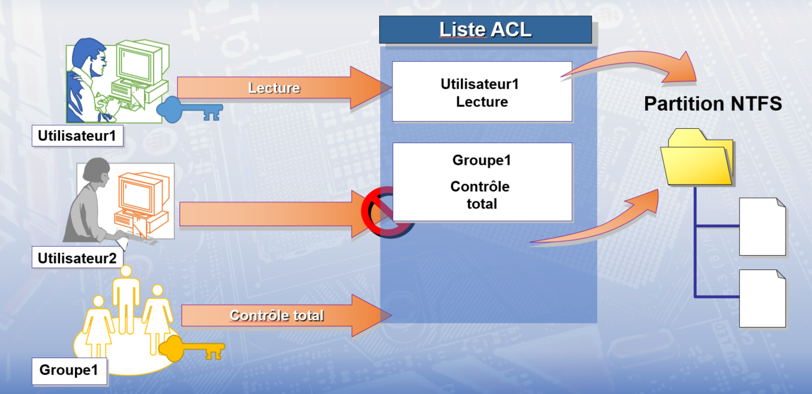
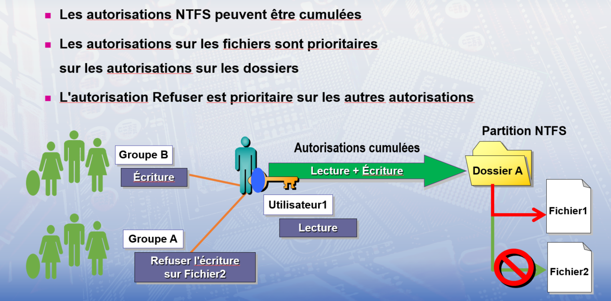
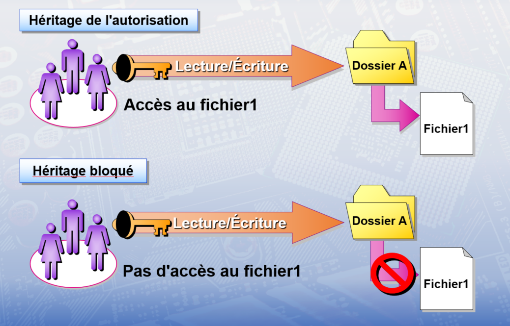
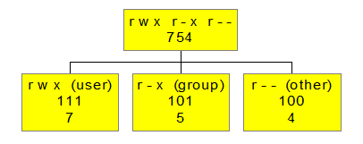

<!-- header: "Module 187 - Droits des fichiers et dossiers" -->
# 10 - Droits des fichiers et dossiers

ID du module 187 : OO8

Ce chapitre traite des droits sur les fichiers et dossiers de Windows et Linux.

---

## Droits NTFS

Les droits NTFS concernent l'accès aux données sur un disque, tandis que les droits sur les partages concernent l'accès réseau. Ces droits sont différents et complémentaires.

La gestion des droits se fait dans les *Propriétés*, onglet *Sécurité* :
- Partie supérieure : groupes/personnes
- Partie inférieure : droits associés

---

## Propriétés des dossiers

- Général
- Partage
- Sécurité
- Versions précédentes
- Personnaliser

---

## Propriétés des fichiers

- Général
- Sécurité
- Détails
- Versions précédentes

---

## Droits sur les dossiers

---

## Droits sur les fichiers

---

## Droits spéciaux et modification

Dans l'onglet *Sécurité* > bouton *Modifier* :
- Partie supérieure : groupes/utilisateurs
- Partie inférieure : autorisations pour la sélection

---

## Droits avancés

Dans l'onglet *Sécurité* > bouton *Avancé* :
- Autorisation
- Audit
- Accès effectif

---

## ACL, ACE, héritage

- Les droits NTFS sont stockés dans une ACL
- **ACL** (Access Control List) : liste de ACE
- **ACE** (Access Control Entry) : entrée contenant SID et droits
- Un dossier parent a une ACL, les enfants héritent des droits

---

## Interdiction et héritage

- L’interdiction prévaut sur l’autorisation
- Le droit explicite prévaut sur le droit hérité
- L'héritage transmet les droits aux dossiers/fichiers enfants

---

---

---

## Droits lors des déplacements et copies

- Copie : autorisations de la destination
- Déplacement : autorisations d'origine si même partition, sinon celles de la destination

[NTFS-malekal](https://www.malekal.com/les-autorisations-et-la-gestion-de-fichiers-et-partagessous-windows-avec-le-systeme-de-fichiers-ntfs-2/)

---

---

## Chemin absolu et relatif

- Absolu : depuis la racine (Windows : lettre, Linux : /)
- Relatif : depuis le répertoire courant (Windows : .\desktop, Linux : ../etc)

---

## Droits Linux

Pour voir les droits d'un fichier :
- `ls -l` dans le répertoire

---

## Propriétaires et permissions

Trois sortes de propriétaires :
- u = user
- g = group
- o = other
- a = all

Droits :
- r = read
- w = write
- x = execute

---

## Droits sur répertoire et fichier

- Répertoire : r (contenu visible), w (modification), x (traverser)
- Fichier : r (lecture), w (modification), x (exécution)

Remarques :
- Utilisateur/groupe référencés dans /etc/passwd et /etc/group
- Seuls le propriétaire et root peuvent modifier les droits (chmod)
- Pour qu’un fichier soit accessible, tous les répertoires supérieurs doivent avoir x
- Pour créer/supprimer, il faut w sur le parent

---

## Attribution des droits : CHMOD

- Syntaxe : chmod mode [-R] fichier
- Mode : symbolique ou octal

Exemples :
- chmod 754 fichier <=> chmod a=r,ug+x,u+w fichier
- chmod 674 fichier <=> chmod a=rw,g+x,o-w fichier

---

## Droits à la création

- Répertoire : rwx r-x r-x (755)
- Fichier : rw- r-- r-- (644)
- Droits complets (777/666) fixés par le système
- umask soustrait à ces droits (022 par défaut)

---

## Modification propriétaire/groupe

- CHOWN : chown [-R] new-user fichier
- CHGRP : chgrp [-R] new-group fichier
- Seul root peut utiliser ces commandes

[Permissions Linux Goffinet](https://linux.goffinet.org/05-03-permissions-linux/)

[Permissions Ubuntu](https://doc.ubuntu-fr.org/permissions)
